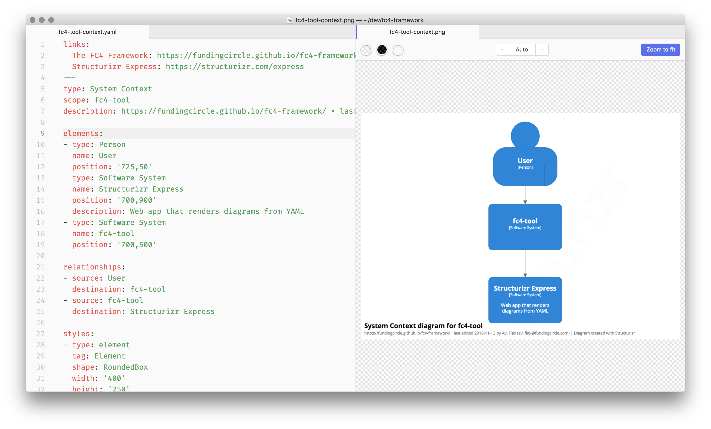
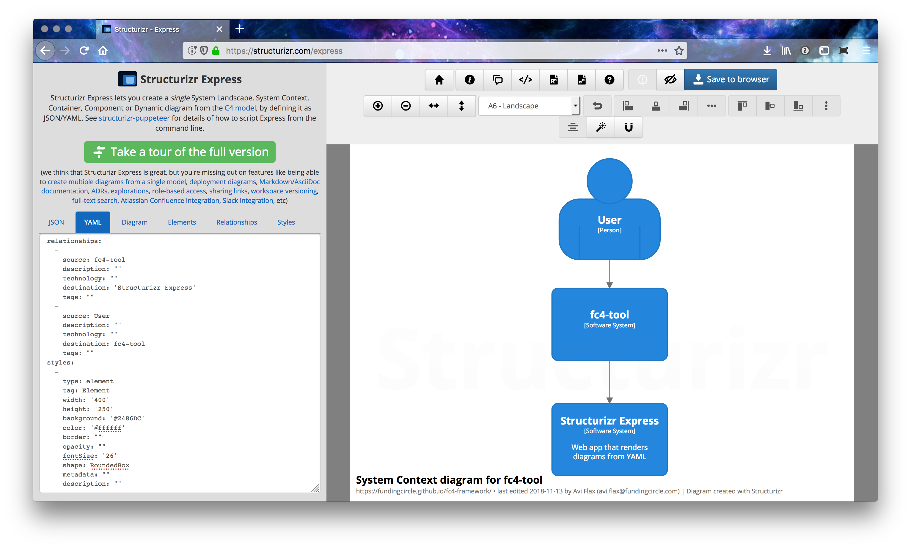

# 5. The Authoring Workflow « The FC4 Methodology

## Summarized Workflow

1. Run `fc4 edit path/to/repo` to start fc4-tool watching for changes
1. Create and/or edit diagram YAML files
1. fc4-tool will automatically process the YAML files and render them to PNG image files
1. Run `git commit` to commit the new/changed files

## Full Workflow

1. Create a new git branch in your local instance of [the diagram repository](repository.md)
1. In your text editor: either create a new diagram source file or open an existing diagram source file
1. In your terminal, run `fc4 edit path/to/repo`
   1. This starts [fc4-tool](toolset.md#fc4-tool) watching your repository for changes to any
      diagram source YAML file (or new files) and process and render each file when it changes
1. In your text editor, open a diagram YAML file in one pane and its rendered PNG file in an
   adjacent pane
   1. If the diagram is new then the PNG file won’t exist until you’ve saved the YAML file and
      fc4-tool has successfully rendered the diagram
1. Edit the diagram YAML by adding/changing elements, relationships, etc, then save the file
   1. This will cause fc4-tool to process the YAML file and render the diagram to a PNG file
   1. Ideally your editor will see the changes the open files and automatically refresh your open
      buffers/windows/tabs so you can immediately see the changes
   1. Continue to edit the YAML, save the file, and observe the changes to the PNG until you’re
      happy with the changes
1. In your terminal, hit `ctrl-c` to stop fc4-tool
1. Use your git UI of choice to commit your changes
1. Push your local changes to the remote repository regularly
1. When you’re ready to submit your changes for review, open a
   [Merge Request](https://docs.gitlab.com/ee/user/project/merge_requests/index.html) or
   [Pull Request](https://help.github.com/articles/about-pull-requests/) to get your changes
   reviewed and then merged into master

Here’s a screenshot of an editor with a diagram open in two panes:

## Optional: Using Structurizr Express for Graphical Editing

This is optional, but can be very helpful when you need to make broad layout changes, or experiment
quickly with various changes to a layout.

During an editing session as described above, when you have both files of a diagram open in your
editor, you can use [Structurizr Express](https://structurizr.com/help/express) (SE) like so:

1. Select the entire contents of the YAML file in your text editor and cut it into your clipboard
1. Switch to your Web browser and open SE
1. Once SE has loaded, click the YAML tab on the left-hand side of the UI
1. Paste the diagram source into the YAML textarea
1. Press tab to blur the textarea
1. SE will either render the diagram, or display a red error indicator in its toolbar
   1. If SE shows its red error indicator, click the indicator button to bring up a dialog listing the errors
1. Use the right-hand side of SE to arrange the elements and edges as desired
   1. Don’t worry about aligning elements precisely; fc4-tool will take care of this for you
1. Cut the diagram source from the SE YAML textarea into your clipboard
1. Switch back to your editor, paste the diagram source into the YAML file buffer, and save the file
1. fc4-tool will see that the YAML file has changed, and will process it as described above
   1. Of note, as described in [The Toolset](toolset.md), the processing includes “snapping” the
      elements and vertices of a diagram to a virtual grid, which has the effect of precisely
      aligning elements that had been only roughly aligned

Here’s a screenshot of Structurizr Express:

----

Please continue to [Publishing](publishing.md) or go back to [the top page](README.md).
