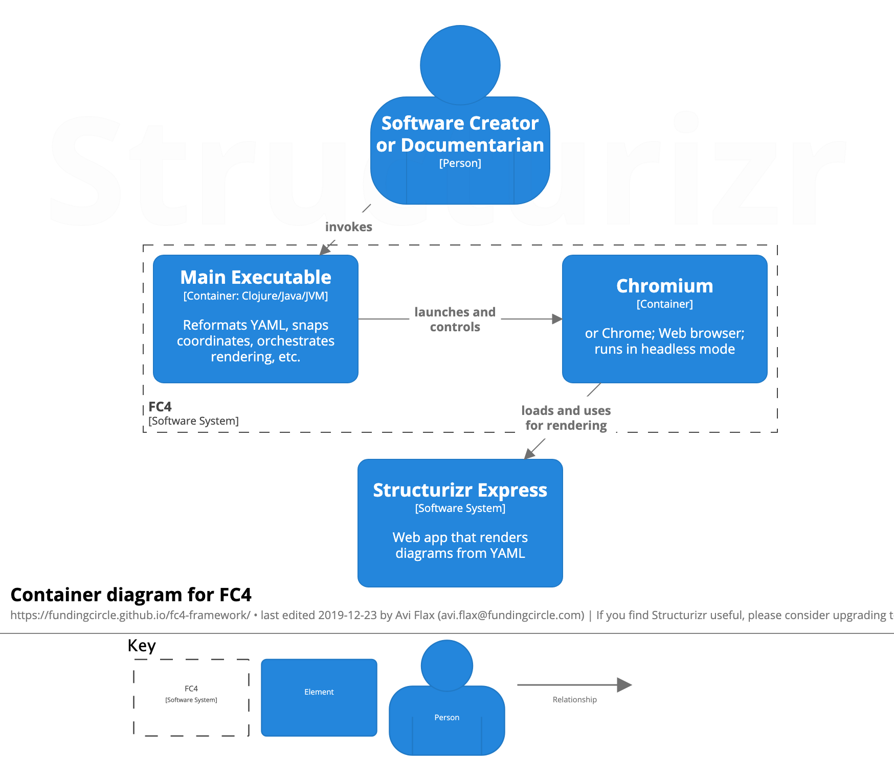

---
redirect_from:
  - tool/index.html
---
# FC4

<figure>
  
  <figcaption>Example: a container diagram of FC4 itself.</figcaption>
</figure>

FC4 is a [_Docs as Code_][docs-as-code] tool that helps software creators and
[documentarians][documentarians] author software architecture diagrams using
[the C4 model for visualising software architecture][c4-model].

<ul id="info">
  <li id="builds">
    It builds on <a href="https://structurizr.com/express">Structurizr Express</a>.
  </li>
  <li id="thanks">
    Many thanks to <a href="http://simonbrown.je/">Simon Brown</a> for creating and maintaining both
    the C4 model and Structurizr Express.
  </li>
  <li id="origin">
    It originated at and is maintained by <a href="https://engineering.fundingcircle.com/">Funding
    Circle</a>.
  </li>
</ul>

## Get Started

To get started, please see [Get started with FC4](docs/get-started).

## Help & Feedback

If you have any questions or feedback please [create an issue][new-issue] and one of the maintainers
will get back to you shortly.

## Documentation

* [Change History](change-history)
* [Command Line Interface (CLI) Reference](docs/reference/cli)
* [Developing and Testing](docs/dev)
* [Features](docs/features)
* [Installation](docs/manual/installation)
* [The Name](docs/name)
* [User Manual](docs/manual)

## See Also

* For the origin story of FC4, see [this blog post][fc4-blog-post].

## Source Code

This tool is [Free and Libre Open Source Software (FLOSS)][floss]; its source code is readily
available for review or modification via [its GitHub repository][repo].

## Copyright & License

Copyright © 2018–2019 Funding Circle Ltd.

Distributed under [the BSD 3-Clause License][license].

[c4-model]: https://c4model.com/
[docs-as-code]: https://www.writethedocs.org/guide/docs-as-code/
[documentarians]: https://www.writethedocs.org/documentarians/
[fc4-blog-post]: https://engineering.fundingcircle.com/blog/2018/09/07/the-fc4-framework/
[floss]: https://en.wikipedia.org/wiki/Free_and_open-source_software
[license]: https://github.com/FundingCircle/fc4-framework/blob/main/LICENSE
[new-issue]: https://github.com/FundingCircle/fc4-framework/issues/new
[repo]: https://github.com/FundingCircle/fc4-framework
